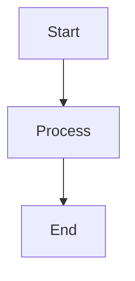

# Execute Prompt 15: Visual Content Suggester

**Version:** 0.16.0
**⚡ Token Efficient:** ~5,000 tokens (75% reduction from v0.14.0)
**CLI-ONLY (bulk) / HYBRID (single chapter)**

**FIRST ACTION - MANDATORY:**
Reference `Process/Prompts/Prompt_Essentials.md` (loaded once per session via /fw-init)

---

## Quick Start

Analyzes chapters for visual opportunities and creates **text-based placeholders** (markdown tables, ASCII diagrams, flowcharts) that can later be upgraded to professional graphics via Prompt 16.

**Visual System:**
- **Location:** `Manuscript/images/` (flat directory)
- **Naming:** `fig-XX-YY-description.md`
- **Registry:** `Image_Registry.md` (single or split mode)
- **Status:** 📝 Text-based

---

## Workflow (6 Steps)

1. Ask scope and analysis mode
2. Acquire locks
3. Scan content for visual opportunities
4. Create text-based visuals
5. Register and reference
6. Commit and release locks

---

## Step 0: Lock Management

**Acquire locks:**
1. Generate instance ID: `CLI-[5-digit]`
2. Lock `Chapter_XX` (for each chapter)
3. Lock `ImageRegistry`

**Mode 1 (Scan Only):** No locks needed (read-only)

See: Prompt_Essentials.md → Lock Management

---

## Step 1: Questions

**Ask user:**

1. **Scope:** Which chapters?
2. **Analysis mode:**
   - Scan only (report opportunities)
   - Scan and create (create visuals)
   - Create from instructions (user specifies)

3. **Visual types:** (or all)
   - Tables (comparison, data, reference)
   - Flowcharts (processes, decisions)
   - Diagrams (concepts, relationships)
   - Timelines (chronological events)

---

## Step 2: Registry Type Detection

**Before creating visuals:**

1. Read first 15 lines of `Image_Registry.md`
2. If "Registry Type: Split" → add to chapter registry
3. If not → add to single registry

---

## Step 3: Visual Opportunities to Scan

### What to Look For

| Opportunity | Indicators | Visual Type |
|-------------|------------|-------------|
| Comparisons | "vs", "compared to", lists | Table |
| Processes | Steps, sequences, "then" | Flowchart |
| Data | Numbers, percentages, trends | Chart placeholder |
| Relationships | Hierarchies, dependencies | Diagram |
| Timelines | Dates, chronological order | Timeline |

---

## Step 4: Create Text-Based Visuals

### File Format

```markdown
# Figure X.Y: [Title]

## Visual Content

[Table, diagram, or flowchart in markdown/ASCII]

---

## Metadata

- **Type:** [Table | Diagram | Flowchart | Timeline]
- **Chapter:** X
- **Location:** After paragraph about [topic]
- **Purpose:** [What this visual explains]
- **Upgrade Priority:** [High | Medium | Low]
- **Professional Graphic Notes:** [Suggestions for designer]
```

### Visual Formats

**Table:**
```markdown
| Column 1 | Column 2 | Column 3 |
|----------|----------|----------|
| Data 1   | Data 2   | Data 3   |
```

**Flowchart (ASCII):**
```
┌─────────┐
│  Start  │
└────┬────┘
     │
┌────▼────┐
│ Step 1  │
└────┬────┘
     │
┌────▼────┐
│   End   │
└─────────┘
```

**Mermaid (if supported):**


---

## Step 5: Register and Reference

### Registry Entry

```markdown
### fig-XX-YY-description
- **Figure:** X.Y
- **Title:** [Title]
- **Type:** [Table | Diagram | Flowchart]
- **Status:** 📝 Text-based (Markdown)
- **File:** `images/fig-XX-YY-description.md`
- **Referenced in:** Chapter_XX.md:line
- **Alt Text:** "[Description]"
- **Caption:** "Figure X.Y: [Caption]"
- **Created:** YYYY-MM-DD by Prompt 15
- **Upgrade Priority:** [High | Medium | Low]
```

### Chapter Reference

```markdown


**Figure X.Y:** Caption text
```

---

## Step 6: Commit & Release

```bash
git add Manuscript/images/fig-XX-YY-*.md
git add Manuscript/images/Image_Registry.md
git add Manuscript/Chapters/Chapter_XX/*
git commit -m "$(cat <<'EOF'
ADD: Visual content for Chapter XX v[version]

- Created N text-based visuals
- Types: [tables/diagrams/flowcharts]
- Ready for professional upgrade via Prompt 16

🤖 Generated with Claude Code - Prompt 15

Co-Authored-By: Claude <noreply@anthropic.com>
EOF
)"
```

Release locks for all acquired resources.

---

## Output Report

```markdown
## Visual Content Report

**Chapters analyzed:** 3, 5
**Opportunities found:** 12
**Visuals created:** 8

### Created Visuals

| Figure | Type | Chapter | Priority |
|--------|------|---------|----------|
| fig-03-01 | Table | 3 | High |
| fig-03-02 | Flowchart | 3 | Medium |
| fig-05-01 | Diagram | 5 | High |

### Opportunities Not Created

- Chapter 3, line 234: Data chart (needs actual data)
- Chapter 5, line 89: Photo placeholder (needs image)

### Next Steps

1. Review created visuals in context
2. Upgrade high-priority figures (Prompt 16)
3. Add missing data for deferred visuals
```

---

## Upgrade Path

**To upgrade 📝 to 🖼️:**

1. Create professional graphic (designer or tool)
2. Use Prompt 16 Mode 2 (Upgrade)
3. Registry auto-updates: 📝 → 🖼️

---

📖 **For detailed examples and visual templates:** See `Process/Prompts/Prompt_15_Reference.md`

📖 **For registry splitting:** See `Process/_COMMON/19_Image_Registry_Splitting_Module.md`

---

**Version:** 0.16.0
**Last Updated:** 2025-11-24
**Token Efficiency:** 75% reduction

---

## Session Cleanup

Tell user: "✓ Prompt 15 Visual Content complete.

To free up tokens, say: **'Clear Prompt 15 from context'**"
